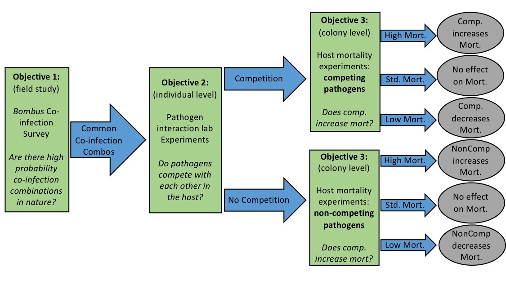
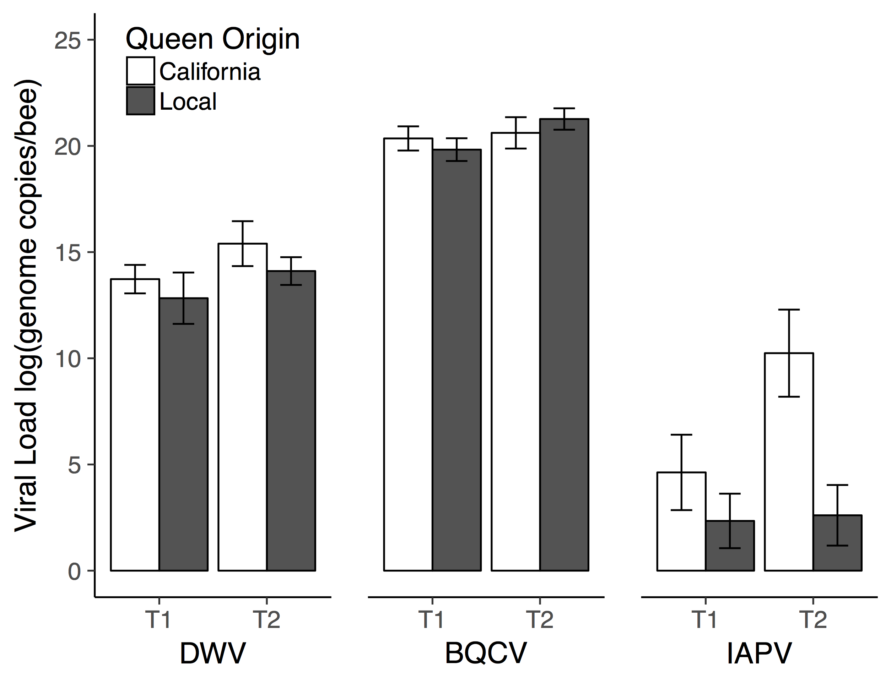
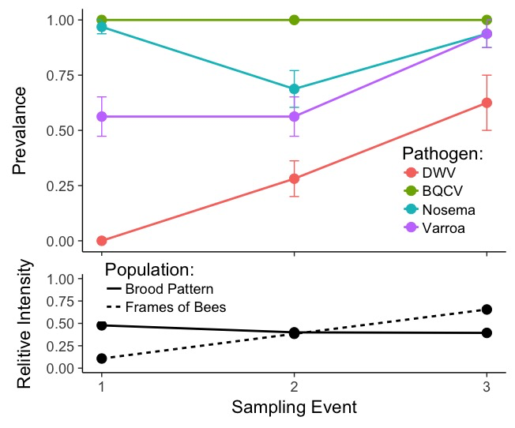

# Figures:

P. Alexander Burnham

## Rough Flow Chart of my Dissertation:

## Viral Load in Local vs. California Re-queened Colonies:

## Pathogen Prevalence Temporal Variation and Co-infection:

