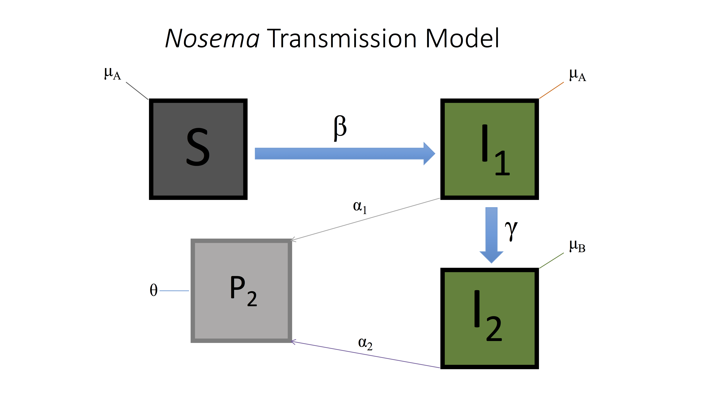

```{r}
######################################################################################################
# Nosema Model Mk I
# P. Alexander Burnham
# 6 April 2016
######################################################################################################

# Parameters:
#----------------------------------------------------------------------

# dSdt = -[S][P]beta-[S]muA
# dI1dt = [S][P]beta-[I1]muA-[I1]gamma
# dI2dt = -[I1][P]gamma-[I2]muB
# dPdt = [I1]alpha1 + [I2]alpha2-[P]theta
# S = Initial Bombus Population on landscape
# I1 = Portion of Bombus infected
# I2 = Portion of Infected that are critically infected
# P = Population of fecal matter on landscape (mL)
# beta = rate of conversion from S to I1
# alpha1 = rate of fecal deposition from I1 to P (mL)
# alpha2 = rate of fecal deposition from I2 to P (mL)
# theta = decay of P (mL)
# gamma = rate of conversion from I1 to I2
# muA = natural death rate of S and I1
# muB = death rate of critically infected
# time = time (days)

#-----------------------------------------------------------------------------------------------------
# Preliminaries: 
ls()
rm(list=ls())

#-----------------------------------------------------------------------------------------------------
# model MK 1:

library(deSolve)

NosemaModel1 <- function(t, state, parameters){
  with(as.list(c(state, parameters)), {
    
    dSdt <- -(S * P * beta) - (S * muA) 
    dI1dt <- (S * P * beta) - (I1 * muA) - (I1 * gamma) 
    dI2dt <- (I1 * P * gamma) - (I2 * muB)
    dPdt <- (I1 * alpha1) + (I2 * alpha2) - (P * theta) 
    
    return(list(c(dSdt,dI1dt,dI2dt,dPdt)))
  })
}

# set parameters
state<-c(S=1,I1=0.10, I2=0.00, P=0.0)
parameters <- c(#r=0.05,
                beta=0.34,
                alpha1=0.05,
                alpha2=0.10,
                gamma=0.04,
                muA=0.01,
                muB=0.03,
                theta=0.01
                )

times <- seq(0,150,by=1)

out <- ode(y=state,times=times, func=NosemaModel1, parms=parameters)
out<-as.data.frame(out)
out$time <- NULL
head(out,10)

#Plot figure
matplot(x=times,y=out,
        type="l",
        xlab="Time (days)", 
        ylab="Nosema", 
        main="Nosema Model MKI",
        lwd=2,
        lty=1,
        font.lab=2,
        bty="l", 
        col=2:5)

grid(col="gray")

legend(x=100,y=0.8,
       c("Susceptable",
         "Infected",
         "Critically Infected", 
         "Nosema Reservoir"),
       pch=19,
       col=2:5,
       bty="n",
       bg="white")

```

```{r}
######################################################################################################
# Nosema Model MKII (11 April 2016) Plotting Infected Feces on Landscape 
# on a second figure to the right. 
######################################################################################################


# Parameters:
#----------------------------------------------------------------------

# dSdt = -[S][P]beta-[S]muA
# dI1dt = [S][P]beta-[I1]muA-[I1]gamma
# dI2dt = -[I1][P]gamma-[I2]muB
# dPdt = [I1]alpha1 + [I2]alpha2-[P]theta
# S = Initial Bombus Population on landscape
# I1 = Portion of Bombus infected
# I2 = Portion of Infected that are critically infected
# P = Population of fecal matter on landscape (mL)
# beta = rate of conversion from S to I1
# alpha1 = rate of fecal deposition from I1 to P (mL)
# alpha2 = rate of fecal deposition from I2 to P (mL)
# theta = decay of P (mL)
# gamma = rate of conversion from I1 to I2
# muA = natural death rate of S and I1
# muB = death rate of critically infected
# time = time (days)


#------------------------------------------------------------------------

# Preliminaries: 
ls()
rm(list=ls())

library(deSolve)

# create a function using desolve
NosemaModel2 <- function(t, state, parameters){
  with(as.list(c(state, parameters)), {
    
    dSdt <- -(S * P * beta) - (S * muA) 
    dI1dt <- (S * P * beta) - (I1 * muA) - (I1 * gamma) 
    dI2dt <- (I1 * P * gamma) - (I2 * muB)
    dPdt <- (I1 * alpha1) + (I2 * alpha2) - (P * theta) 

    
    return(list(c(dSdt,dI1dt,dI2dt,dPdt)))
  })
}

# set parameters
state<-c(S=1, I1=0.05, I2=0.00, P=0.0)
parameters <- c(#r=0.05,
  beta=0.202,
  alpha1=0.07,
  alpha2=0.010,
  gamma=0.05,
  muA=0.011,
  muB=0.025,
  theta=0.01
)

# set up time steps
times <- seq(0,150,by=1)

#Subset data and remove time
out <- ode(y=state,times=times, func=NosemaModel2, parms=parameters)
out<-as.data.frame(out)
out$time <- NULL
out$S <- NULL
NosemaLS <- out
NosemaLS <- (NosemaLS[,3])
out$P <- NULL
Surv <- 1 - (out[,1]+out[,2])
out <- cbind(out,Surv)
head(out,10)

par(mfrow=c(1,2))

#Plot figure
matplot(x=times,y=out,
        type="l",
        xlab="Time (days)", 
        ylab="Rate of Nosema Infection", 
        main="Infection Rate through Time",
        lwd=3,
        ylim=c(0,1),
        lty=1,
        font.lab=2,
        bty="l", 
        col=c("blue","red", "green"))

grid(col="gray")

legend(x=58,y=0.6,
       legend=c("Infected",
         "Critically Infected",
         "Susceptable"),
       pch=19,
       col=c("blue","red", "green"),
       bty="n",
       bg="white")

# plot figure for nosema on LS seperately.

plot(x=times,y=NosemaLS,
     type="l",
     xlab="Time (days)", 
     ylab="Infected Feces on LS", 
     main="Nosema on Landscape",
     ylim=c(0,2),
     lwd=3,
     lty=1,
     font.lab=2,
     bty="l", 
     col="red")

grid(col="gray")


```


```{r}
######################################################################################################
######################################################################################################
######################################################################################################
# Nosema Model MKIV (28 April 2016) Removed curve describing nosema reservoir on landscape for simplicity. This is the iteration used during my biolunch talk:
######################################################################################################
######################################################################################################
######################################################################################################

# Parameters:
#-----------------------------------------------------------------------------------------------------

# dSdt = -[S][P]beta-[S]muA
# dI1dt = [S][P]beta-[I1]muA-[I1]gamma
# dI2dt = -[I1][P]gamma-[I2]muB
# dPdt = [I1]alpha1 + [I2]alpha2-[P]theta
# S = Initial Bombus Population on landscape
# I1 = Portion of Bombus infected
# I2 = Portion of Infected that are critically infected
# P = Population of fecal matter on landscape (mL)
# beta = rate of conversion from S to I1
# alpha1 = rate of fecal deposition from I1 to P (mL)
# alpha2 = rate of fecal deposition from I2 to P (mL)
# theta = decay of P (mL)
# gamma = rate of conversion from I1 to I2
# muA = natural death rate of S and I1
# muB = death rate of critically infected
# time = time (days)


#------------------------------------------------------------------------

# Preliminaries: 
ls()
rm(list=ls())

library(deSolve)

par(mfrow=c(1,1))

# initial state of system
state<-c(S=1, I1=0.05, I2=0.00, P=0.0)

# set parameters
parameters <- c(
  beta=0.202,
  alpha1=0.07,
  alpha2=0.010,
  gamma=0.05,
  muA=0.011,
  muB=0.025,
  theta=0.01
)

#====================================================================================================
# create a function for this disease system using desolve
NosemaModel4 <- function(t, state, parameters){
  with(as.list(c(state, parameters)), {
    
    dSdt <- -(S * P * beta) - (S * muA) 
    dI1dt <- (S * P * beta) - (I1 * muA) - (I1 * gamma) 
    dI2dt <- (I1 * P * gamma) - (I2 * muB)
    dPdt <- (I1 * alpha1) + (I2 * alpha2) - (P * theta) 
    
    
    return(list(c(dSdt,dI1dt,dI2dt,dPdt)))
  })
}
#====================================================================================================

# set up time steps
times <- seq(0,150,by=1)


# use ode() to to create an output
out <- ode(y=state,times=times, func=NosemaModel4, parms=parameters)
out<-as.data.frame(out)

# remove unwanted columns for this model
out$time <- NULL
out$S <- NULL
out$P <- NULL

# set survival equal to  1 - pooled infected (I1+I2)
Surv <- 1 - (out[,1]+out[,2])
out <- cbind(out,Surv)
head(out,10)


#---------------------------------------------------------------------------------------------------
#par(mfrow=c(1,2))
#Plot figure

matplot(x=times,y=out,
        type="l",
        xlab="Time (days)", 
        ylab="Rate of Nosema Infection", 
        main="Infection Rate through Time",
        lwd=3,
        ylim=c(0,1),
        lty=1,
        font.lab=2,
        bty="l", 
        col=c("blue","red", "green"))

grid(col="gray")

legend(x=100,y=0.6,
       legend=c("Infected",
                "Critically Infected",
                "Susceptable"),
       pch=19,
       col=c("blue","red", "green"),
       bty="n",
       bg="white")

#####################################################################################################
# END MODEL MKIV


```


